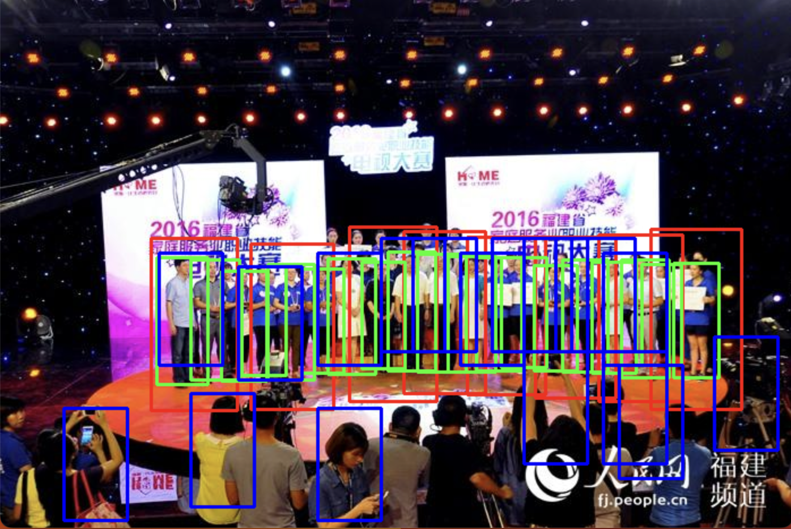
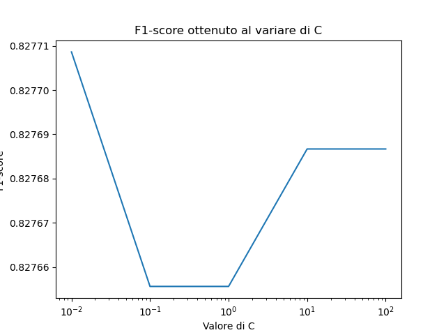

# HOG-SVM-Pedestrian-Detector

This repository contains a pedestrian detection system developed as an assignment for the [Computer Vision](https://www.unipa.it/dipartimenti/ingegneria/cds/ingegneriainformatica2035/?template=responsive&pagina=insegnamento&idInsegnamento=171775&idDocente=155776&idCattedra=167762) course in the Master's degree in Computer Engineering with focus on Artificial Intelligence at the [University of Palermo](https://www.unipa.it/).

The system implements a pedestrian detection algorithm using Histogram of Oriented Gradients (HOG) features and a Support Vector Machine (SVM) classifier. It is trained and evaluated on the WiderPerson dataset.

## Dataset and Feature Extraction

This project uses the [WiderPerson](http://www.cbsr.ia.ac.cn/users/sfzhang/WiderPerson) dataset for positive samples (pedestrians). Additionally, it utilizes images from the `negative` folder to generate negative samples (non-pedestrians). For each positive sample, 5 negative samples are generated, creating a balanced dataset for training, testing, and validation.

The feature extraction process combines data from both the WiderPerson dataset and the negative samples to create comprehensive HOG features for the model.


## Key Components

1. `features_extraction.py`: Extracts HOG features from images.
2. `features_preprocessing.py`: Preprocesses the extracted features.
3. `preprocessing_comparison.py`: Compares different preprocessing techniques.
4. `report_finale.py`: Generates the final report.
5. `search_T.py`: Searches for the optimal threshold value.
6. `train_svm.py`: Trains the SVM classifier.

### Utility Functions

- `medie_dataset.py`: Calculates dataset statistics.
- `non_maximum_suppression.py`: Implements non-maximum suppression.
- `sliding_window.py`: Implements sliding window technique.
- `utility_functions.py`: Contains various utility functions.

## Usage

This repository includes a pre-trained model that has been trained on the entire dataset using standardized features with PCA applied. To use the model and generate results, simply run the `report_finale.py` script:
```sh
python report_finale.py
```

This script provides three options:

1. View the test set results
2. Display the results on the test set (and compares it with the OpenCV model)
3. Show examples using our model on custom images

Choose the desired option to explore the model's performance and visualize the results.

### Test Set Results

Below are some screenshots showing the performance of our model on the test set, where the bounding boxes drawn by our model are in blue, the ones from OpenCV in red and the green ones represent the gts.

- **Detection Success**: 
  
  In this example, our model successfully detected almost all pedestrians in the scene.

- **Detection Failure**: 
  
  In this case, the model missed every pedestrian.


## Metrics Results

The results can be found after running the `report_finale.py` script. The script generates a comparative table that shows the performance of our custom model against the OpenCV's default pedestrian detector. Here's the result of the results table of the model inside this repo:

| Modello        | TP   | FP   | FN    | Precision | Recall  | F1-Score |
| -------------- | ---- | ---- | ----- | --------- | ------- | -------- |
| Our Model | 4102    | 22959   | 13731    | 0.2425    | 0.3123  | 0.2730   |
| OpenCV         | 1124 | 4600 | 16709 | 0.3697    | 0.1590  | 0.2224   |

Additionally, in the `plots` directory, there is a `.png` file that shows the F1-score variation with respect to the SVM hyperparameter C from the training process.

Here is the plot we got:



This plot illustrates how the F1-score changes as the hyperparameter C varies during the SVM training, highlighting the optimal value for C that yields the best performance.


